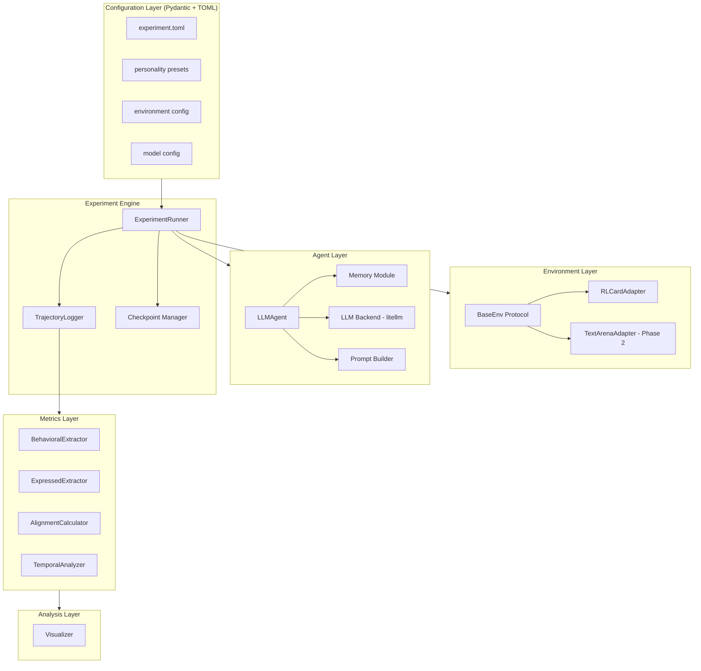
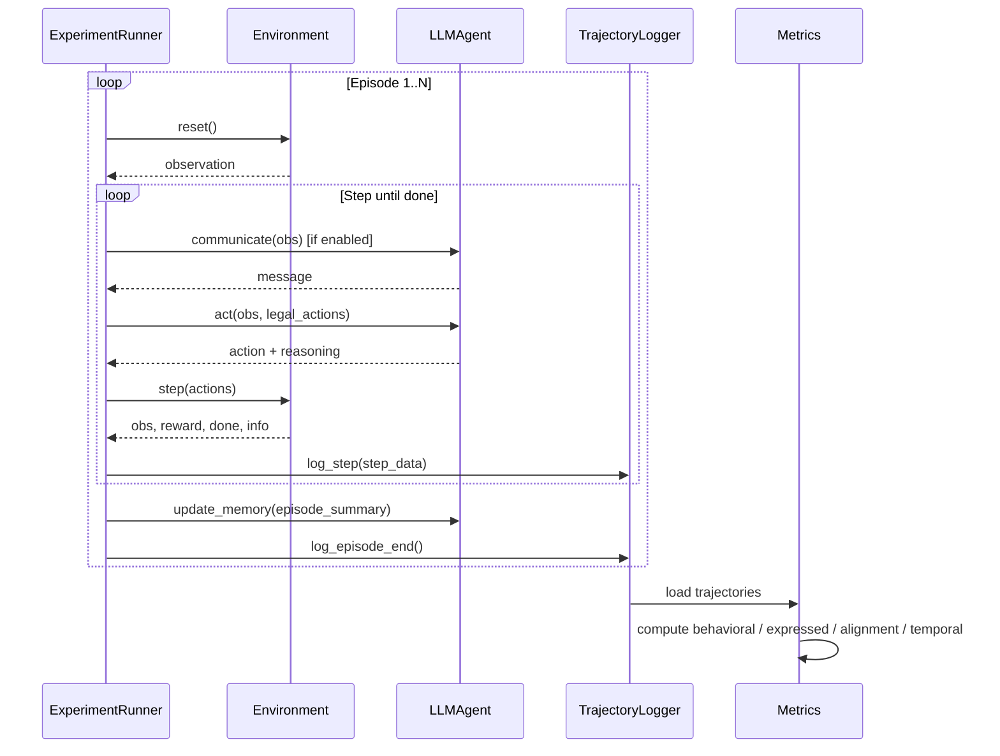

## Product Overview

Persona-Gap 是一个学术研究框架，用于量化测量 LLM agents 在多智能体交互环境中"表达人格"与"行为人格"之间的差距。核心研究问题：LLM agents 说的和做的是否一致？

## Core Features

1. **人格注入与 Agent 系统**：将 4 维人格向量 (risk, aggression, cooperation, deception) 通过 prompt 注入 LLM agent，agent 具备记忆模块，支持决策（act）和通信（communicate）两种输出

2. **可插拔环境适配**：统一 Gym-like 接口 + 环境注册表（Registry）模式，支持结构化环境（如 RLCard 的任意游戏：Leduc Hold'em / UNO / Blackjack 等）和语言环境（如 TextArena 谈判/辩论），通过适配器模式接入。action 人格标注由 TOML 配置驱动（而非硬编码），新环境接入只需：①写 adapter 类 ②注册到 registry ③提供 action annotation 配置

3. **多轮交互实验引擎**：支持多 agent 交互、50-100 episodes 重复博弈、持久化跨 episode 记忆、可配置对比变量（人格类型/有无通信/有无记忆）

4. **双通道人格提取**：

- 行为人格（Behavioral）：从 trajectory 统计提取各维度行为比率
- 表达人格（Expressed）：从 agent 语言输出通过 LLM-as-judge 分析提取特征

5. **对齐与一致性度量**：计算 Alignment（表达 vs 行为差距）、Temporal Consistency（跨 episode 稳定性）、Personality Drift（人格漂移）

6. **实验日志与分析可视化**：step 级别结构化日志记录、实验结果持久化、指标计算与可视化图表生成

## Tech Stack

- **语言**: Python 3.11+
- **配置管理**: Pydantic v2 + TOML（Python 3.11 内置 tomllib，零额外依赖）
- **数据模型**: Pydantic v2（配置验证、数据结构定义）
- **LLM 后端**: litellm（统一封装 OpenAI/Claude/本地模型调用）
- **环境依赖**: rlcard（Leduc Hold'em 等卡牌环境）、textarena（语言博弈环境，Phase 2 预留）
- **日志**: structlog（结构化运行时日志）+ JSONL（实验数据日志）
- **数据分析**: pandas + numpy + matplotlib + seaborn
- **包管理**: pip + pyproject.toml
- **测试**: pytest

## Implementation Approach

采用 **配置驱动 + 分层抽象 + 渐进交付** 的策略。

**核心思路**：将系统分为 5 个正交模块层（环境层、Agent 层、实验引擎层、指标层、分析层），每层通过 Protocol 定义接口契约，具体实现可插拔替换。所有实验参数通过 TOML 配置文件管理，Pydantic 做类型验证，避免硬编码。先用 Leduc Hold'em 跑通完整 pipeline，再扩展更多环境。

**关键技术决策**：

1. **Pydantic + TOML 而非 Hydra + YAML**：项目初期不需要 Hydra 的 multirun/config group 等重量级功能。TOML 可读性优于 YAML，Python 3.11+ 内置 `tomllib` 零依赖读取，与 `pyproject.toml` 风格统一。跑多组实验用简单 Python 循环脚本即可，后期如有需要再迁移到 Hydra 也无缝兼容（底层都是 dataclass/Pydantic）。

2. **litellm 统一 LLM 后端**：提供统一接口适配 100+ LLM provider，一行代码切换模型，研究中对比不同模型表现时极为方便，与 OpenAI SDK 调用方式完全兼容。

3. **Protocol 定义接口**：Python Protocol 支持结构化子类型（structural subtyping），环境适配器和 trait extractor 无需显式继承即可满足接口约束，对接第三方库（如 rlcard）更灵活。

4. **LLM 输出约束采用 JSON mode + 重试**：强制 LLM 返回 JSON 格式的 action + reasoning，解析失败时自动重试（最多 3 次），降低输出发散风险，同时保留 reasoning 用于 expressed personality 分析。

5. **日志双层设计**：structlog 负责运行时调试日志；独立的 TrajectoryLogger 以 JSONL 格式逐 step 写入实验数据，方便 pandas 加载分析。

## Implementation Notes

- **LLM 调用成本控制**：每次 LLM 调用记录 token usage，实验结束输出总成本摘要；支持配置 temperature 和 max_tokens 避免意外高消耗
- **环境 action mapping 防错**：LLM 可能输出非法 action，需要 fallback 机制（从 legal_actions 中选最相似的或随机选一个），并在日志中标记 fallback 事件
- **断点续跑**：每个 episode 结束后保存 checkpoint（当前 episode 编号 + memory 状态），实验中断后可从上次 checkpoint 恢复
- **可复现性**：配置中记录 random seed，LLM 调用记录完整的 prompt/response，确保实验可追溯
- **TOML 配置组织**：主配置文件 `experiment.toml` 包含顶层参数，人格预设、环境、模型参数分别作为子表（sub-table），也可通过多个 TOML 文件按实验分组

## Architecture Design

### System Architecture



### Data Flow



### Core Data Models

```python
from pydantic import BaseModel, Field

class PersonalityVector(BaseModel):
    """4 维人格向量"""
    risk: float = Field(ge=0.0, le=1.0)
    aggression: float = Field(ge=0.0, le=1.0)
    cooperation: float = Field(ge=0.0, le=1.0)
    deception: float = Field(ge=0.0, le=1.0)

class StepRecord(BaseModel):
    """单步交互记录"""
    episode_id: int
    step: int
    agent_id: str
    observation: str
    legal_actions: list[str]
    action: str
    reasoning: str
    message: str | None = None
    reward: float
    is_fallback: bool = False

class AgentConfig(BaseModel):
    """Agent 配置"""
    agent_id: str
    personality: PersonalityVector
    model: str  # litellm model name
    temperature: float = 0.7
    max_tokens: int = 512
    memory_enabled: bool = True
    communication_enabled: bool = True

class ExperimentConfig(BaseModel):
    """实验顶层配置"""
    seed: int = 42
    num_episodes: int = 50
    output_dir: str = "outputs/"
    env: EnvConfig
    agents: list[AgentConfig]
```

```python
from typing import Protocol, Any, TypedDict

class ActionAnnotation(TypedDict):
    """动作的人格维度标注"""
    is_risky: bool
    is_aggressive: bool
    is_cooperative: bool
    is_deceptive: bool

class BaseEnv(Protocol):
    """环境统一协议"""
    @property
    def num_agents(self) -> int: ...

    def reset(self) -> dict[str, str]: ...

    def step(self, actions: dict[str, str]) -> tuple[
        dict[str, str], dict[str, float], bool, dict[str, Any]
    ]: ...

    def get_legal_actions(self, agent_id: str) -> list[str]: ...

    def get_action_annotations(self, agent_id: str) -> dict[str, ActionAnnotation]: ...
```

## Directory Structure

```
persona-gap/
├── pyproject.toml                    # [NEW] 项目元数据与依赖定义（pydantic, litellm, rlcard, structlog, pandas, matplotlib, seaborn, pytest），使用 pip install -e . 安装
├── README.md                         # [MODIFY] 更新安装说明、使用指南、项目架构概述
├── configs/                          # [NEW] TOML 配置目录
│   ├── experiment.toml               # [NEW] 默认实验配置：seed、num_episodes、output_dir、env 设置、agents 列表（含人格向量和模型参数）
│   ├── presets/                       # [NEW] 人格预设目录
│   │   ├── aggressive.toml           # [NEW] 高攻击性人格预设（risk=0.8, aggression=0.9, cooperation=0.2, deception=0.5）
│   │   ├── cooperative.toml          # [NEW] 高合作性人格预设
│   │   ├── deceptive.toml            # [NEW] 高欺骗性人格预设
│   │   └── conservative.toml         # [NEW] 保守型人格预设
│   ├── envs/                          # [NEW] 环境专属配置目录（action 人格标注由配置驱动，非硬编码）
│   │   ├── leduc_holdem.toml         # [NEW] Leduc Hold'em 的 action annotation 配置：定义 raise/call/fold/check 各对应哪些人格维度
│   │   └── README.md                 # [NEW] 说明如何为新游戏/环境添加 action annotation 配置
│   └── batch_example.toml            # [NEW] 批量实验配置示例：展示如何定义多组实验参数组合
├── src/
│   └── persona_gap/                   # [NEW] 主包
│       ├── __init__.py               # [NEW] 包初始化，暴露版本号
│       ├── core/                      # [NEW] 核心数据模型与配置加载
│       │   ├── __init__.py
│       │   ├── models.py             # [NEW] 全部 Pydantic 数据模型：PersonalityVector, StepRecord, EpisodeResult, AgentConfig, EnvConfig, ExperimentConfig 等
│       │   └── config.py             # [NEW] TOML 配置加载器：用 tomllib 读取 TOML，用 Pydantic 验证并返回 ExperimentConfig；支持从文件路径或 dict 加载
│       ├── envs/                      # [NEW] 环境适配层
│       │   ├── __init__.py
│       │   ├── protocol.py           # [NEW] BaseEnv Protocol 定义：reset/step/get_legal_actions/get_action_annotations 接口，ActionAnnotation TypedDict
│       │   └── rlcard_adapter.py     # [NEW] RLCard Leduc Hold'em 适配器：包装 rlcard 环境为 BaseEnv 协议，实现 observation 文本化（手牌+公共牌+筹码描述）、action 人格标注（raise=risky+aggressive, call=cooperative, fold=conservative, check=neutral）
│       ├── agents/                    # [NEW] Agent 层
│       │   ├── __init__.py
│       │   ├── llm_agent.py          # [NEW] LLMAgent 核心类：接收 obs+legal_actions，通过 PromptBuilder 构建完整 prompt，调用 LLMBackend 获取 JSON 响应，解析 action+reasoning，含 fallback 到随机合法 action 的容错机制
│       │   ├── memory.py             # [NEW] Memory 模块：episode 摘要存储（list[str]），summarize() 返回最近 K 条摘要的拼接文本，支持滑动窗口控制 context 长度
│       │   └── prompts.py            # [NEW] Prompt 模板：decision_prompt() 组合人格描述+记忆摘要+当前观察+合法动作列表，communication_prompt() 生成通信消息，personality_to_text() 将 PersonalityVector 转为自然语言
│       ├── llm/                       # [NEW] LLM 后端
│       │   ├── __init__.py
│       │   └── backend.py            # [NEW] LLMBackend 类：基于 litellm.completion() 封装，支持 JSON mode（response_format）、自动重试（max 3 次）、token usage 累计追踪、调用耗时记录
│       ├── runner/                    # [NEW] 实验引擎
│       │   ├── __init__.py
│       │   ├── experiment.py         # [NEW] ExperimentRunner：从 ExperimentConfig 初始化环境和 agents，编排多 episode 循环（reset->communicate->act->step->log），管理 agent 轮次调度
│       │   ├── logger.py             # [NEW] TrajectoryLogger：以 JSONL 格式逐 step 追加写入 StepRecord，提供 load_trajectory() 返回 list[StepRecord]，支持按 episode/agent 过滤
│       │   └── checkpoint.py         # [NEW] CheckpointManager：episode 粒度保存/恢复（JSON 序列化当前 episode_id + 各 agent memory 内容），支持断点续跑
│       ├── metrics/                   # [NEW] 指标计算层
│       │   ├── __init__.py
│       │   ├── behavioral.py         # [NEW] BehavioralExtractor：从 StepRecord 列表按 agent 聚合，根据 action_annotations 计算各维度行为比率 -> PersonalityVector
│       │   ├── expressed.py          # [NEW] ExpressedExtractor：收集 agent 的 reasoning+message 文本，通过 LLM-as-judge prompt 评估各维度表达强度 -> PersonalityVector
│       │   ├── alignment.py          # [NEW] AlignmentCalculator：behavioral vs expressed 向量对比，计算 L1 距离、余弦相似度、逐维度差异
│       │   └── temporal.py           # [NEW] TemporalAnalyzer：按 episode 分组计算行为向量序列，输出 consistency（方差）和 drift（与首 episode 的距离序列）
│       └── analysis/                  # [NEW] 分析与可视化
│           ├── __init__.py
│           └── visualize.py          # [NEW] 可视化：人格雷达图（matplotlib radar chart）、对齐热力图（seaborn heatmap）、漂移折线图、多 agent 对比柱状图，输出 PNG
├── scripts/                           # [NEW] 入口脚本
│   ├── run_experiment.py             # [NEW] 单次实验入口：加载 TOML 配置 -> 初始化 -> 运行 -> 计算指标 -> 生成可视化
│   └── run_batch.py                  # [NEW] 批量实验入口：读取 batch 配置，循环跑多组实验（人格x通信x记忆 组合）
└── tests/                             # [NEW] 测试
    ├── __init__.py
    ├── test_models.py                # [NEW] Pydantic 模型和 TOML 配置加载测试
    ├── test_rlcard_adapter.py        # [NEW] RLCard 适配器功能测试（reset/step/action_annotations）
    └── test_metrics.py               # [NEW] 指标计算正确性测试（behavioral/alignment/temporal）
```

## Agent Extensions

### SubAgent

- **code-explorer**
- Purpose: 在实现环境适配层时，探索 rlcard 库的 API 结构（环境初始化、observation 格式、action space、step 返回值等），确保通用适配器实现准确
- Expected outcome: 准确了解 rlcard 环境的调用方式和数据格式，生成支持多游戏的通用 RLCardAdapter 代码