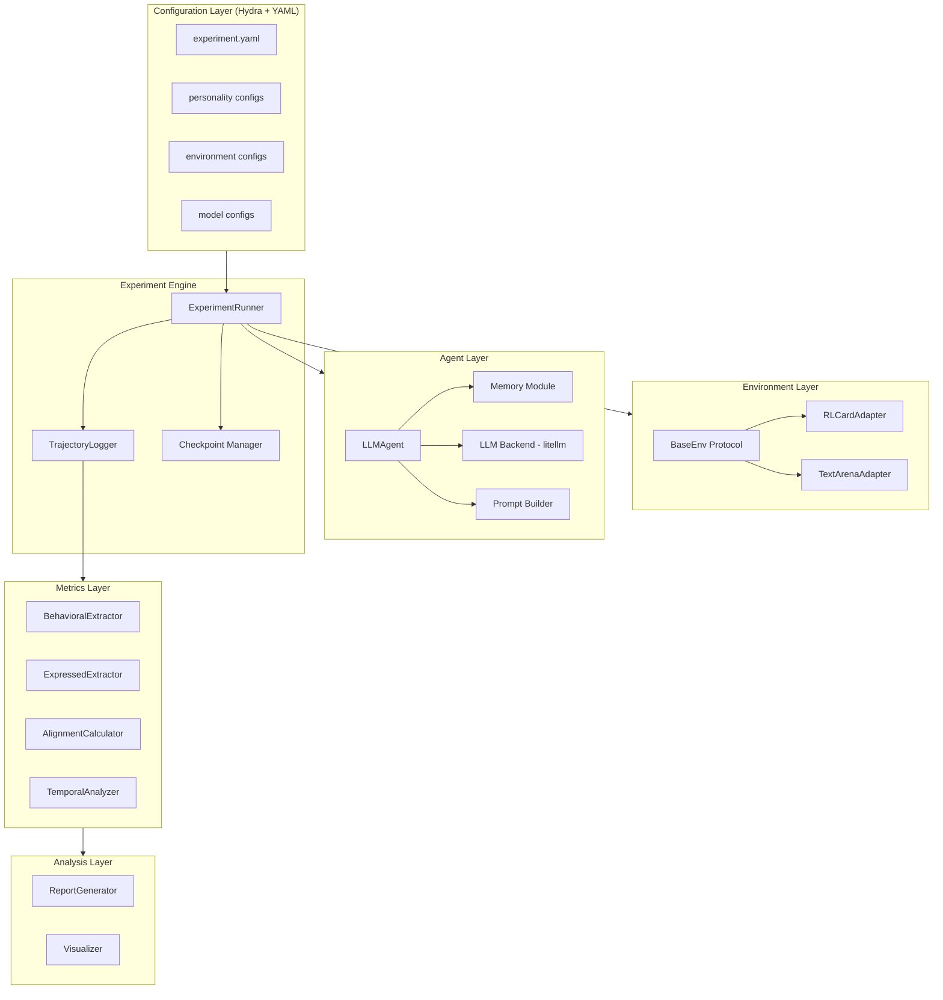
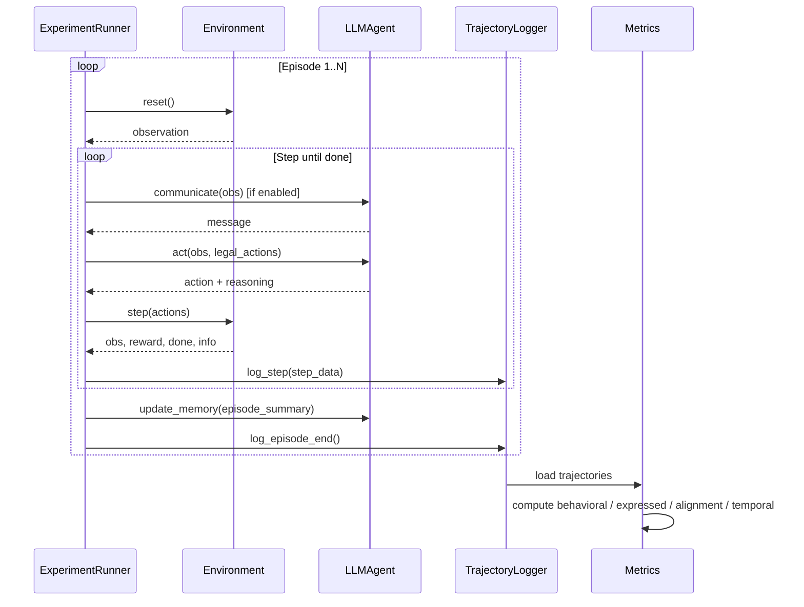

## Product Overview

Persona-Gap 是一个学术研究框架，用于量化测量 LLM agents 在多智能体交互环境中"表达人格"与"行为人格"之间的差距。核心研究问题：LLM agents 说的和做的是否一致？

## Core Features

1. **人格注入与 Agent 系统**：将 4 维人格向量 (risk, aggression, cooperation, deception) 通过 prompt 注入 LLM agent，agent 具备记忆模块，支持决策（act）和通信（communicate）两种输出

2. **可插拔环境适配**：统一 Gym-like 接口，支持结构化环境（如 RLCard Leduc Hold'em）和语言环境（如 TextArena 谈判/辩论），通过适配器模式接入

3. **多轮交互实验引擎**：支持多 agent 交互、50-100 episodes 重复博弈、持久化跨 episode 记忆、可配置对比变量（人格类型/有无通信/有无记忆）

4. **双通道人格提取**：

- 行为人格（Behavioral）：从 trajectory 统计提取各维度行为比率
- 表达人格（Expressed）：从 agent 语言输出通过 NLP/LLM 分析提取特征

5. **对齐与一致性度量**：计算 Alignment（表达 vs 行为差距）、Temporal Consistency（跨 episode 稳定性）、Personality Drift（人格漂移）

6. **实验日志与分析**：step 级别结构化日志记录、实验结果持久化、指标计算与可视化分析

## Tech Stack

- **语言**: Python 3.11+
- **配置管理**: Hydra + OmegaConf（YAML 配置驱动实验）
- **数据模型**: Pydantic v2（配置验证、数据结构定义）
- **LLM 后端**: litellm（统一封装 OpenAI/Claude/本地模型调用）
- **环境依赖**: rlcard（Leduc Hold'em 等卡牌环境）、textarena（语言博弈环境，Phase 2）
- **日志**: structlog（结构化日志）
- **数据分析**: pandas + numpy + matplotlib/seaborn
- **包管理**: pip + pyproject.toml
- **测试**: pytest

## Implementation Approach

采用**配置驱动 + 分层抽象 + 分阶段交付**的策略。

**核心思路**：将整个系统分为 5 个正交模块层（环境层、Agent 层、实验引擎层、指标层、分析层），每层通过 Protocol/ABC 定义接口契约，具体实现可插拔替换。所有实验参数（人格配置、环境选择、episode 数量、LLM 模型等）通过 Hydra YAML 配置文件管理，避免硬编码，支持命令行覆盖，方便批量实验。

**关键技术决策**：

1. **用 litellm 而非直接调 OpenAI SDK**：litellm 提供统一接口适配 100+ LLM provider，一行代码切换模型，研究中需要对比不同模型表现时极为方便，且与 OpenAI SDK 调用方式完全兼容，无额外学习成本。

2. **用 Hydra 而非 argparse/手动 YAML**：学术实验需要大量参数组合（4 种人格 x 有无通信 x 有无记忆 = 16 种配置），Hydra 的 multirun 和 config group 天然支持这种实验矩阵，且自动管理输出目录。

3. **用 Protocol 而非 ABC 定义接口**：Python Protocol 支持结构化子类型（structural subtyping），环境适配器和 trait extractor 无需显式继承即可满足接口约束，对接第三方库（如 rlcard）更灵活。

4. **LLM 输出约束采用 JSON mode + 重试**：强制 LLM 返回 JSON 格式的 action + reasoning，解析失败时自动重试（最多 3 次），降低输出发散风险，同时保留 reasoning 用于 expressed personality 分析。

5. **日志采用双层设计**：structlog 负责运行时调试日志；独立的 TrajectoryLogger 以 JSONL 格式逐 step 写入实验数据，方便后续 pandas 加载分析。

## Implementation Notes

- **LLM 调用成本控制**：每次 LLM 调用记录 token usage，实验结束输出总成本；支持配置 temperature 和 max_tokens 避免意外高消耗
- **环境 action mapping 防错**：LLM 可能输出非法 action，需要 fallback 机制（从 legal_actions 中选最相似的或随机选一个），并在日志中标记 fallback 事件
- **断点续跑**：每个 episode 结束后保存 checkpoint（当前 episode 编号 + memory 状态），实验中断后可从上次 checkpoint 恢复
- **可复现性**：配置中记录 random seed，LLM 调用记录完整的 prompt/response，确保实验可追溯

## Architecture Design

### System Architecture



### Data Flow



### Core Data Models

```python
# 核心数据结构（Pydantic models）

class PersonalityVector(BaseModel):
    """4维人格向量"""
    risk: float = Field(ge=0.0, le=1.0)
    aggression: float = Field(ge=0.0, le=1.0)
    cooperation: float = Field(ge=0.0, le=1.0)
    deception: float = Field(ge=0.0, le=1.0)

class StepRecord(BaseModel):
    """单步交互记录"""
    episode_id: int
    step: int
    agent_id: str
    observation: str
    legal_actions: list[str]
    action: str
    reasoning: str
    message: str | None
    reward: float
    is_fallback: bool  # 是否发生了 action fallback

class AgentConfig(BaseModel):
    """Agent 配置"""
    agent_id: str
    personality: PersonalityVector
    model: str  # litellm model name, e.g. "gpt-4o-mini"
    temperature: float = 0.7
    memory_enabled: bool = True
    communication_enabled: bool = True
```

## Directory Structure

本项目从零搭建，以下为完整目录结构：

```
persona-gap/
├── pyproject.toml                    # [NEW] 项目元数据与依赖定义，使用 pip install -e . 安装
├── README.md                         # [MODIFY] 更新安装和使用说明
├── configs/                          # [NEW] Hydra 配置目录
│   ├── experiment.yaml               # [NEW] 主实验配置：episode数量、seed、输出路径等顶层参数
│   ├── personality/                   # [NEW] 人格配置组
│   │   ├── aggressive.yaml           # [NEW] 高攻击性人格预设
│   │   ├── cooperative.yaml          # [NEW] 高合作性人格预设
│   │   ├── deceptive.yaml            # [NEW] 高欺骗性人格预设
│   │   └── conservative.yaml         # [NEW] 保守型人格预设
│   ├── env/                           # [NEW] 环境配置组
│   │   ├── leduc.yaml                # [NEW] Leduc Hold'em 环境配置
│   │   └── negotiation.yaml          # [NEW] TextArena 谈判环境配置（Phase 2 占位）
│   └── model/                         # [NEW] LLM 模型配置组
│       ├── gpt4o_mini.yaml           # [NEW] GPT-4o-mini 模型参数
│       └── claude_sonnet.yaml        # [NEW] Claude Sonnet 模型参数
├── src/
│   └── persona_gap/                   # [NEW] 主包
│       ├── __init__.py               # [NEW] 包初始化
│       ├── core/                      # [NEW] 核心数据模型
│       │   ├── __init__.py
│       │   └── models.py             # [NEW] Pydantic 数据模型：PersonalityVector, StepRecord, AgentConfig, EpisodeResult 等所有核心数据结构
│       ├── envs/                      # [NEW] 环境适配层
│       │   ├── __init__.py
│       │   ├── protocol.py           # [NEW] BaseEnv Protocol 定义：reset/step/get_legal_actions/get_action_annotations 接口约束
│       │   └── rlcard_adapter.py     # [NEW] RLCard 适配器：将 rlcard 的 Leduc 环境包装为 BaseEnv 协议，实现 observation 文本化、action 标注（哪些是高风险/攻击性/合作性动作）
│       ├── agents/                    # [NEW] Agent 层
│       │   ├── __init__.py
│       │   ├── llm_agent.py          # [NEW] LLMAgent 类：接收 observation 和 legal_actions，构建 prompt 调用 LLM，解析 JSON 输出为 action+reasoning，支持 communicate() 生成消息，包含 fallback 和重试机制
│       │   ├── memory.py             # [NEW] Memory 模块：存储 episode 摘要，提供 summarize() 生成文本摘要，支持滑动窗口控制 context 长度
│       │   └── prompts.py            # [NEW] Prompt 模板管理：decision prompt、communication prompt、personality description 生成函数，将 PersonalityVector 转为自然语言描述
│       ├── llm/                       # [NEW] LLM 后端抽象
│       │   ├── __init__.py
│       │   └── backend.py            # [NEW] LLM 调用封装：基于 litellm 的统一调用接口，支持 JSON mode、重试、token usage 追踪、调用日志记录
│       ├── runner/                    # [NEW] 实验引擎
│       │   ├── __init__.py
│       │   ├── experiment.py         # [NEW] ExperimentRunner：编排多 agent 多 episode 交互循环，管理 agent 轮次调度、通信阶段、决策阶段，调用 logger 和 checkpoint
│       │   ├── logger.py             # [NEW] TrajectoryLogger：将 StepRecord 以 JSONL 格式追加写入文件，episode 结束时写入分隔标记，支持按 episode/agent 查询
│       │   └── checkpoint.py         # [NEW] CheckpointManager：episode 粒度保存/恢复实验状态（当前 episode、各 agent memory、累计日志路径），支持断点续跑
│       ├── metrics/                   # [NEW] 指标计算层
│       │   ├── __init__.py
│       │   ├── behavioral.py         # [NEW] BehavioralExtractor：从 trajectory 数据计算 4 维行为人格向量，每个维度的计算规则由环境的 action_annotations 驱动
│       │   ├── expressed.py          # [NEW] ExpressedExtractor：从 agent 的 reasoning 和 message 文本中通过 LLM-as-judge 提取表达人格向量
│       │   ├── alignment.py          # [NEW] AlignmentCalculator：计算行为-表达对齐度（L1距离、余弦相似度、KL散度）
│       │   └── temporal.py           # [NEW] TemporalAnalyzer：计算跨 episode 行为一致性、人格漂移曲线
│       └── analysis/                  # [NEW] 分析与可视化
│           ├── __init__.py
│           └── visualize.py          # [NEW] 可视化工具：人格雷达图、对齐热力图、漂移折线图、对比柱状图，输出 PNG/PDF
├── scripts/                           # [NEW] 入口脚本
│   └── run_experiment.py             # [NEW] Hydra 入口：加载配置、初始化环境和 agent、启动 ExperimentRunner、实验结束后运行 metrics 计算和可视化
└── tests/                             # [NEW] 测试目录
    ├── __init__.py
    ├── test_models.py                # [NEW] 数据模型单元测试
    ├── test_rlcard_adapter.py        # [NEW] RLCard 适配器测试
    └── test_metrics.py               # [NEW] 指标计算测试
```

## Key Code Structures

```python
# 环境协议定义 - 所有环境适配器必须满足的接口
from typing import Protocol, Any

class ActionAnnotation(TypedDict):
    """动作的人格维度标注"""
    is_risky: bool
    is_aggressive: bool
    is_cooperative: bool
    is_deceptive: bool

class BaseEnv(Protocol):
    """环境统一协议"""
    @property
    def num_agents(self) -> int: ...
    
    def reset(self) -> dict[str, str]:
        """返回 {agent_id: observation_text}"""
        ...
    
    def step(self, actions: dict[str, str]) -> tuple[
        dict[str, str],   # observations
        dict[str, float],  # rewards
        bool,              # done
        dict[str, Any]     # info
    ]: ...
    
    def get_legal_actions(self, agent_id: str) -> list[str]: ...
    
    def get_action_annotations(self, agent_id: str) -> dict[str, ActionAnnotation]:
        """返回每个合法动作的人格维度标注，用于 behavioral trait 计算"""
        ...
```

```python
# LLM Agent 核心接口
class LLMAgent:
    def __init__(self, config: AgentConfig, llm_backend: LLMBackend): ...
    
    def act(self, observation: str, legal_actions: list[str],
            action_history: list[str] | None = None) -> tuple[str, str]:
        """返回 (action, reasoning)"""
        ...
    
    def communicate(self, observation: str,
                    dialogue_history: list[str] | None = None) -> str:
        """生成通信消息"""
        ...
    
    def update_memory(self, episode_summary: str) -> None: ...
    
    def get_memory_context(self) -> str: ...
```

## Agent Extensions

### SubAgent

- **code-explorer**
- Purpose: 在实现各模块时探索 rlcard 和 textarena 等第三方库的 API 接口，确认适配器实现的准确性
- Expected outcome: 准确了解第三方库的调用方式，生成兼容的适配器代码